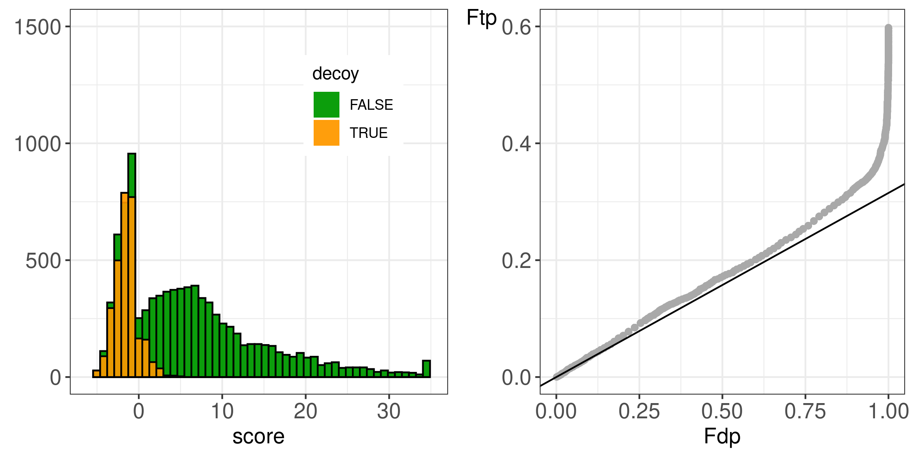

<a rel="license" href="https://creativecommons.org/licenses/by-sa/4.0/"></a>


```{r echo=FALSE, warning=FALSE, message=FALSE}
if (!tinytex::check_installed("achemso")) tinytex::tlmgr_install("achemso")
if (!tinytex::check_installed("caption")) tinytex::tlmgr_install("caption")
if (!tinytex::check_installed("setspace")) tinytex::tlmgr_install("setspace")
```


(ref:Figure1)  Histogram and PP-plot for a concatenated search on a *Pyrococcus* run against a database of canonical *P. furiosus* sequences from Swiss-Prot using X!Tandem without refinement. Both the histogram and the P-P plot show no violation of the TDA assumptions.
 

```{r sFig1, echo=FALSE, fig.cap="(ref:Figure1)",out.width="99%"}

```


(ref:Figure2)  Histogram and PP-plot for a concatenated search on a *H. sapiens* run against a database of *H. Sapiens* sequences from UniProt using MS-GF+. Both the histogram and the P-P plot show no violation of the TDA assumptions.


```{r sFig2, echo=FALSE, fig.cap="(ref:Figure2)",out.width="99%"}
knitr::include_graphics("./figs/figHumanMsgfPlus.png")
```


(ref:Figure3)  Histogram and PP-plot for a concatenated search on an immunopeptidomics run using Andromeda. Both the histogram and the P-P plot show no violation of the TDA assumptions.
 

```{r sFig3, echo=FALSE, fig.cap="(ref:Figure3)",out.width="99%"}
knitr::include_graphics("./figs/figPeptidomics.png")
```


(ref:Figure4)  Histogram and PP-plot for rank 2 target and decoy PSM scores of a concatenated search on a H. sapiens run against a database of H. Sapiens sequences from UniProt using MS-GF+. 
 

```{r sFig4, echo=FALSE, fig.cap="(ref:Figure4)",out.width="99%"}

```
